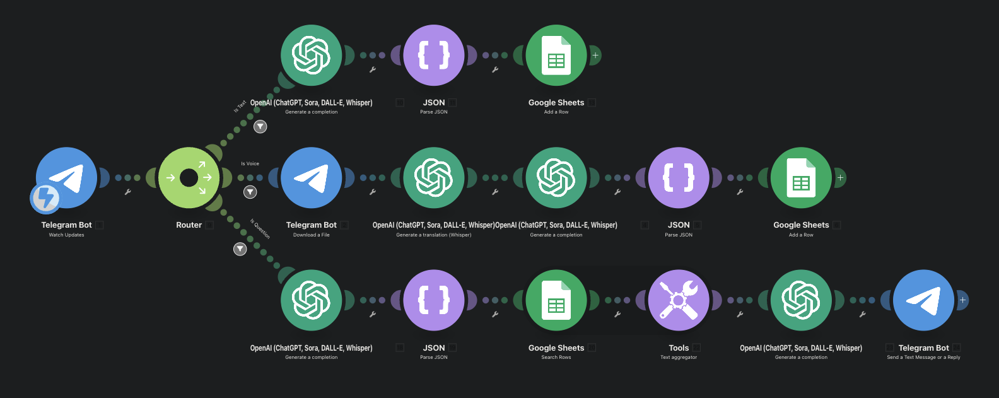
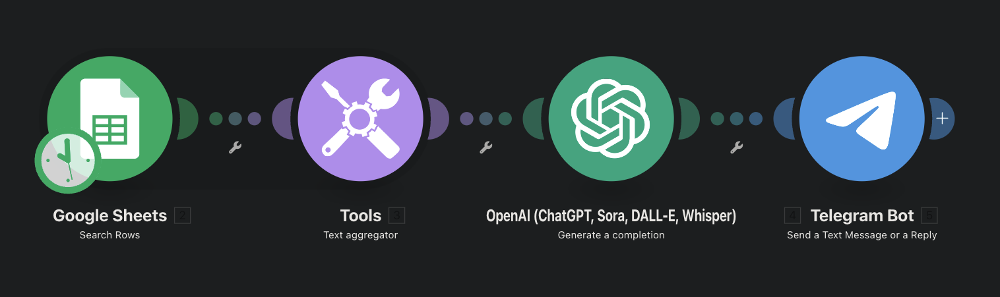

# AI Fitness Companion: "The Digital Gym Buddy" 🏋️‍♂️🤖

## Project Overview
This project is a personal AI-powered fitness agent designed to replace manual workout logging. It acts as a "Digital Gym Buddy" that listens to voice notes or reads text messages, understands the context using LLMs, and automatically logs data into a structured database.

The goal was to build a system that prioritizes speed and accuracy over UI, using a "Voice-First" approach to minimize friction during workouts.

## 🏗 Architecture & Workflow

The system follows a linear automation pipeline:
1.  **Input:** User sends a voice note or text to a Telegram Bot.
2.  **Processing:** * **Audio:** OpenAI Whisper transcribes voice notes to text.
    * **Logic:** OpenAI GPT-4o extracts structured data (Exercise, Sets, Reps, Weight) from the raw text.
3.  **Storage:** Data is pushed to a Google Sheet (Single Source of Truth).
4.  **Feedback:** The bot sends a confirmation message or a daily summary back to the user via Telegram.

## Screenshot
Workflow to save workout into google sheet.

Workflow to generate daily summary.

## Demo

## 🛠 Tech Stack

* **Interface:** Telegram Bot API (The "Front Door")
* **Orchestration:** Make.com (The "Manager" handling API connections)
* **AI Processing:** * **OpenAI Whisper:** Speech-to-Text
    * **OpenAI GPT-4o:** Natural Language Understanding & JSON Extraction
* **Database:** Google Sheets API

## 🚀 Key Features (Scenarios)

This agent handles 6 specific automation scenarios:

1.  **Voice Intake:** Automating the flow from Voice Note → Transcript → Structured JSON → Database.
2.  **Text Intake:** Parsing typed messages for quick logging.
3.  **Daily Accountability:** A scheduled job (9:00 PM) that calculates total volume and summarizes the day's effort.
4.  **History Query:** A "Librarian" mode where the user can ask natural questions (e.g., "What did I do last Monday?") and receive data-driven answers.
5.  **Streak Engine:** Logic to track consistency and gamify the process.
6.  **Error Handling:** Automated alerts if the AI or Database connections fail.

## 💡 Learning Outcomes

Through this project, I explored:
* **Prompt Engineering:** Designing system prompts to reliably extract JSON from messy natural language.
* **API Integration:** Connecting asynchronous services (Telegram) with synchronous processing (OpenAI).
* **Data Normalization:** Converting vague user inputs into strict database formats.